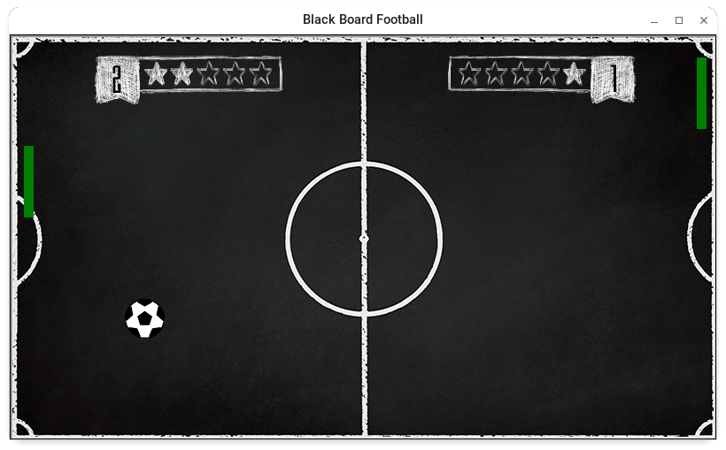

# Pong-Game

Python Game with Turtle Library


---

## Installation

in Python3.\*

```language
pip install -r requirements.txt
```

---

## Dependencies

if you have a this Error
: ImportError \_tkinter as TK # If this fails your Python may not be configured for Tk

for fix install TKinter lib

### Arch Linux

```language
sudo pacman -S tk
```

### Debian/Ubuntu

```language
sudo apt-get update
sudo apt-get install python3-tk
```

---

## Run Game

```language
➜  Graphical-Pong python Pong\ Game.py
```

---

## Contribution

All contributions are assumed to be dual-licensed under MIT/Apache-2.
